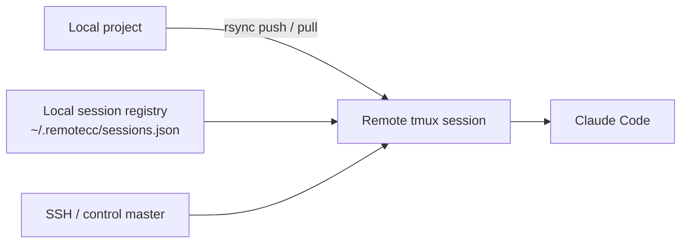

# remotecc


Session-first remote orchestration for Claude Code over SSH.

`remotecc` mirrors a local project to a remote machine, starts Claude Code inside a persistent `tmux` session, routes model choice explicitly, and pulls changes back with a simple, auditable workflow.

This repository is both:

- the Python package in [src/remotecc](./src/remotecc)
- the Codex skill root via [SKILL.md](./SKILL.md)

## Highlights

- Session-first by design. A local registry keeps remote workspace, `tmux`, model, and auth state explicit.
- Skill-ready. `ready --json` and `models --json` provide stable machine interfaces for upstream skills and automations.
- Pragmatic transport. Uses `rsync + ssh + tmux` instead of pretending a remote filesystem mount is reliable enough for agent workflows.
- Human-bootstrap compatible. Password-auth sessions are supported through SSH control master without storing the password.
- Model-aware. Supports `haiku`, `sonnet`, `opus`, `opusplan`, and profile-based routing.

## Architecture



## Why This Exists

Remote-agent workflows usually fail in boring places: broken reconnects, invisible session state, unclear model routing, or ad hoc shell tabs that nobody can recover later.

`remotecc` chooses a narrower path on purpose:

- one explicit remote workspace per session
- one durable `tmux` session per task lane
- one local registry as the operational source of truth
- one predictable sync model instead of live remote mounts

That makes the MVP easier to reason about, easier to automate, and easier to recover.

## Installation

### Install the CLI locally

```bash
python3 -m pip install -e .
```

Or run directly from the repo root:

```bash
python3 scripts/remotecc.py --help
```

### Install as a Codex skill

Manual clone:

```bash
git clone https://github.com/yxhpy/remotecc-claude-session.git ~/.codex/skills/remotecc-claude-session
```

Via `skill-installer`:

```bash
python3 ~/.codex/skills/.system/skill-installer/scripts/install-skill-from-github.py --repo yxhpy/remotecc-claude-session --path . --name remotecc-claude-session --method git
```

Notes:

- `--path .` is required because the repository root is the skill root.
- `--method git` is the reliable fallback when Python download mode hits local SSL certificate issues.
- Restart Codex after installation so the skill is discovered.

## Requirements

Local machine:

- `ssh`
- `rsync`
- Python 3.10+

Remote machine:

- `bash`
- `tmux`
- `rsync`
- `claude` CLI installed and already authenticated

The sync flags stay conservative so the CLI works with the older `rsync` implementation that ships on macOS.

## Quick Start

Create a session:

```bash
python3 scripts/remotecc.py create demo user@host --local-dir . --profile standard
```

Bootstrap with password-auth when the first connection needs a password or key passphrase:

```bash
python3 scripts/remotecc.py create demo user@host --local-dir . --profile standard --password-auth
```

Check non-interactive readiness:

```bash
python3 scripts/remotecc.py ready demo --json
```

If Claude is blocked on a workspace-trust prompt or an edit/bash approval prompt, `ready --json` returns `ready: false` and includes `blocker_kind` plus `blocker_reason`.

Start Claude Code:

```bash
python3 scripts/remotecc.py start demo
```

Send one request:

```bash
python3 scripts/remotecc.py send demo --text "Inspect this repo and summarize the entrypoint."
```

If Claude stops at an interactive approval screen, `send` exits with code `2` and prints a `blocked:` message instead of silently reporting success.

Approve a blocker:

```bash
python3 scripts/remotecc.py approve demo
python3 scripts/remotecc.py approve demo --mode session
```

For longer or noisier work, submit asynchronously and observe only a short pane tail:

```bash
python3 scripts/remotecc.py send demo --text "Implement the change." --no-wait
python3 scripts/remotecc.py observe demo
python3 scripts/remotecc.py observe demo --follow
```

Pull changes back:

```bash
python3 scripts/remotecc.py pull demo
```

Close the session:

```bash
python3 scripts/remotecc.py close demo --drop-remote
```

## Use From Codex

After skill installation, Codex can invoke:

```text
$remotecc-claude-session
```

Example prompt:

```text
Use $remotecc-claude-session to create a remote Claude session on user@host for /abs/project, use the standard profile, start it, and report whether it is ready for non-interactive use.
```

## Session Lifecycle

Each session tracks:

- local working directory
- SSH target
- remote workspace path
- remote `tmux` session name
- Claude command
- model alias and profile
- lifecycle timestamps

Local state is stored in:

```text
~/.remotecc/sessions.json
```

Recommended operational flow:

1. `create`
2. `ready --json`
3. `start`
4. `send`, or `send --no-wait` + `observe`
5. `pull`
6. `close`

While Claude Code is actively editing, treat the remote workspace as the active writer.

## Authentication Posture

There are two intended modes:

- key-based SSH for unattended use
- `--password-auth` for human bootstrap

`--password-auth` does not store passwords. It opens a session-scoped SSH control master so later `ssh` and `rsync` calls can reuse the same authenticated channel.

If the control socket expires:

```bash
python3 scripts/remotecc.py connect demo
```

For skills and automations, the rule is simple:

- a human may bootstrap
- automation should only continue when `ready --json` says the session is usable
- for longer tasks, automation should prefer `send --no-wait` plus `observe --json` over repeatedly calling `capture`

## Claude Model Routing

Ask for machine-readable guidance:

```bash
python3 scripts/remotecc.py models --json
```

Default profiles:

- `simple` -> `haiku`
- `standard` -> `sonnet`
- `complex` -> `opus`
- `plan` -> `opusplan`
- `long` -> `sonnet[1m]`

Practical guidance:

- `haiku` or `hk`: listing, grep, summaries, tiny low-risk edits
- `sonnet`: everyday implementation, common bug fixes, medium refactors
- `opus`: architecture, risky migrations, ambiguous debugging, deep review
- `opusplan`: planning-first workflows where plan quality matters most

Examples:

```bash
python3 scripts/remotecc.py models --json
python3 scripts/remotecc.py create demo user@host --local-dir . --profile standard
python3 scripts/remotecc.py start demo --model opus
python3 scripts/remotecc.py set-model demo --profile complex
python3 scripts/remotecc.py send demo --profile simple --text "Summarize this folder."
```

## Operational Notes

Claude Code itself may still prompt on first use for:

- workspace trust
- edit approval

That is separate from SSH auth. Clear those prompts once during bootstrap, or choose a deliberately permissive Claude command only when that tradeoff is acceptable:

```bash
python3 scripts/remotecc.py create demo user@host --local-dir . --model opus --claude-command "claude --dangerously-skip-permissions"
```

## Scope and Limits

- No live mounted filesystem
- No automatic conflict resolution
- No remote sandboxing
- Pane-based output capture rather than a structured Claude API

This is an MVP session layer, not a distributed development environment.

## Project Status

The project is intentionally narrow and operational:

- repo-root skill packaging is in place
- remote session bootstrap and recovery are implemented
- model routing is explicit and machine-readable
- basic closed-loop validation has been completed

## Repository Layout

- [SKILL.md](./SKILL.md): Codex skill instructions
- [agents/openai.yaml](./agents/openai.yaml): skill UI metadata
- [scripts/remotecc.py](./scripts/remotecc.py): repo-root launcher
- [references/command-cookbook.md](./references/command-cookbook.md): command patterns and common failures
- [src/remotecc](./src/remotecc): Python implementation
- [README.zh-CN.md](./README.zh-CN.md): Chinese guide
- [CONTRIBUTING.md](./CONTRIBUTING.md): contribution workflow
- [SECURITY.md](./SECURITY.md): security reporting
- [CHANGELOG.md](./CHANGELOG.md): release history

## Community and Governance

- [LICENSE](./LICENSE)
- [CONTRIBUTING.md](./CONTRIBUTING.md)
- [CODE_OF_CONDUCT.md](./CODE_OF_CONDUCT.md)
- [SECURITY.md](./SECURITY.md)
- [SUPPORT.md](./SUPPORT.md)
- [CHANGELOG.md](./CHANGELOG.md)
