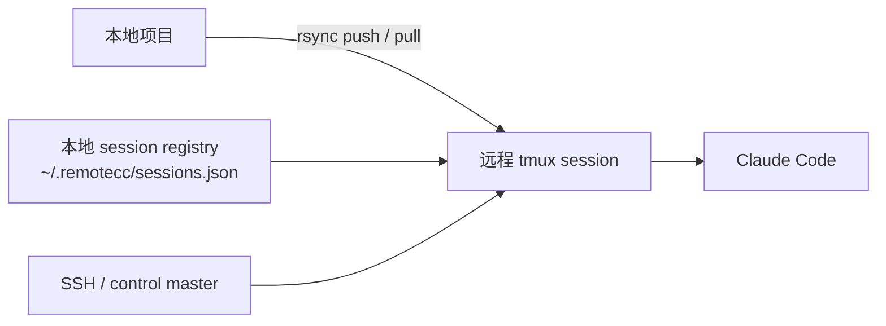

# remotecc


一个面向 Claude Code 的远程会话编排层，强调可恢复、可审计、可自动化。

`remotecc` 通过 `ssh + tmux + rsync` 把本地项目和远程 Claude Code 串成一条清晰的工作链路：同步项目、启动远程会话、下发任务、拉回修改，并把所有 session 状态保存在本地。

当前仓库同时承担两种角色：

- Python 包源码仓库，见 [src/remotecc](./src/remotecc)
- Codex skill 根目录，见 [SKILL.md](./SKILL.md)

## 核心特性

- 以 session 为核心。远程工作目录、`tmux` 会话、模型选择、认证状态都进入本地 registry。
- 面向 skill 集成。`ready --json` 和 `models --json` 可直接给上层 skill 或自动化使用。
- 路径保守而稳定。明确采用 `rsync + ssh + tmux`，不假设远程挂载足够可靠。
- 支持人工 bootstrap。密码登录通过 SSH control master 复用连接，但不保存密码。
- 模型路由明确。支持 `haiku`、`sonnet`、`opus`、`opusplan` 以及 profile 映射。

## 架构概览



## 为什么这样设计

远程 agent 链路真正容易出问题的地方，通常不是“能不能连上 SSH”，而是：

- session 状态不可见
- 断线后无法恢复
- 模型选择没有约束
- 远程 shell 标签页全靠人脑记忆

`remotecc` 故意走一条更窄但更稳定的路线：

- 一个 session 对应一个远程工作目录
- 一个 session 对应一个持久 `tmux` 会话
- 一份本地 registry 作为运行事实来源
- 一条明确的 push / run / pull 链路

这样做的好处是，MVP 阶段更容易自动化，也更容易恢复和审查。

## 安装

### 本地安装 CLI

```bash
python3 -m pip install -e .
```

或者直接从仓库根目录运行：

```bash
python3 scripts/remotecc.py --help
```

### 安装成 Codex skill

手动 clone：

```bash
git clone https://github.com/yxhpy/remotecc-claude-session.git ~/.codex/skills/remotecc-claude-session
```

通过 `skill-installer`：

```bash
python3 ~/.codex/skills/.system/skill-installer/scripts/install-skill-from-github.py --repo yxhpy/remotecc-claude-session --path . --name remotecc-claude-session --method git
```

注意：

- `--path .` 不能省，因为仓库根目录本身就是 skill 根目录
- `--method git` 可以绕过某些机器上的 Python HTTPS 证书问题
- 安装后需要重启 Codex，新的 skill 才会被发现

## 运行依赖

本地机器：

- `ssh`
- `rsync`
- Python 3.10+

远程机器：

- `bash`
- `tmux`
- `rsync`
- 已安装并登录的 `claude` CLI

本地同步参数保持保守兼容，能适配 macOS 自带的旧版 `rsync`。

## 快速开始

创建 session：

```bash
python3 scripts/remotecc.py create demo user@host --local-dir . --profile standard
```

如果 bootstrap 阶段需要密码或私钥口令：

```bash
python3 scripts/remotecc.py create demo user@host --local-dir . --profile standard --password-auth
```

检查是否适合非交互继续执行：

```bash
python3 scripts/remotecc.py ready demo --json
```

启动远程 Claude Code：

```bash
python3 scripts/remotecc.py start demo
```

发送任务：

```bash
python3 scripts/remotecc.py send demo --text "Inspect this repo and summarize the entrypoint."
```

把远程修改拉回本地：

```bash
python3 scripts/remotecc.py pull demo
```

关闭 session：

```bash
python3 scripts/remotecc.py close demo --drop-remote
```

## 在 Codex 中调用

安装成 skill 后，可通过下面这个名字触发：

```text
$remotecc-claude-session
```

示例：

```text
Use $remotecc-claude-session to create a remote Claude session on user@host for /abs/project, use the standard profile, start it, and report whether it is ready for non-interactive use.
```

## Session 生命周期

每个 session 会保存：

- 本地工作目录
- SSH 目标
- 远程工作目录
- 远程 `tmux` session 名称
- Claude 启动命令
- 模型别名和 profile
- 生命周期时间戳

本地状态默认保存在：

```text
~/.remotecc/sessions.json
```

推荐顺序：

1. `create`
2. `ready --json`
3. `start`
4. `send` 或 `chat`
5. `pull`
6. `close`

当 Claude Code 正在远程编辑文件时，应把远程工作目录视为当前写入端。

## 认证策略

推荐两种模式：

- SSH key：适合 unattended 场景
- `--password-auth`：适合由人类先完成 bootstrap

`--password-auth` 不会保存密码，而是建立一个 session 级别的 SSH control master，让后续 `ssh` 和 `rsync` 复用同一条认证后的连接。

如果 control socket 过期：

```bash
python3 scripts/remotecc.py connect demo
```

给上层 skill 的约束是：

- 人类可以完成 bootstrap
- skill 或自动化只有在 `ready --json` 通过后才继续

## 模型选择

先让 CLI 输出机器可读的模型路由：

```bash
python3 scripts/remotecc.py models --json
```

默认 profile 映射：

- `simple` -> `haiku`
- `standard` -> `sonnet`
- `complex` -> `opus`
- `plan` -> `opusplan`
- `long` -> `sonnet[1m]`

建议用法：

- `haiku` 或 `hk`：列目录、grep、摘要、微小低风险改动
- `sonnet`：日常实现、常规 bugfix、中等复杂度重构
- `opus`：架构调整、高风险迁移、疑难排查、深度 review
- `opusplan`：先追求高质量规划，再进入执行

示例：

```bash
python3 scripts/remotecc.py models --json
python3 scripts/remotecc.py create demo user@host --local-dir . --profile standard
python3 scripts/remotecc.py start demo --model opus
python3 scripts/remotecc.py set-model demo --profile complex
python3 scripts/remotecc.py send demo --profile simple --text "Summarize this folder."
```

## 运行说明

Claude Code 第一次在远程机器运行时，仍然可能被自身交互拦住，例如：

- workspace trust
- edit approval

这和 SSH 认证不是一回事。通常做法是 bootstrap 时人工处理一次。

如果你明确接受更宽松的权限模式，也可以传入：

```bash
python3 scripts/remotecc.py create demo user@host --local-dir . --model opus --claude-command "claude --dangerously-skip-permissions"
```

## 当前边界

- 不做实时远程挂载
- 不做自动冲突合并
- 不做远程沙箱
- 当前依赖 `tmux` pane 输出抓取，而不是结构化 Claude API

它是一个面向 MVP 的远程 session 层，不是完整的分布式开发环境。

## 项目状态

当前仓库已经具备这些对外能力：

- repo-root skill 打包结构已稳定
- 远程 session bootstrap 和恢复链路可用
- 模型路由显式可读
- 基本闭环已完成验证

## 仓库结构

- [SKILL.md](./SKILL.md)：Codex skill 说明
- [agents/openai.yaml](./agents/openai.yaml)：skill 元数据
- [scripts/remotecc.py](./scripts/remotecc.py)：仓库根目录入口
- [references/command-cookbook.md](./references/command-cookbook.md)：命令示例与常见故障
- [src/remotecc](./src/remotecc)：Python 实现
- [README.md](./README.md)：英文说明
